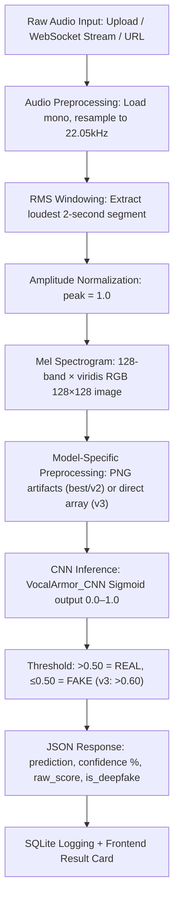

# VocalArmor

> **Real-Time Deepfake Voice Detection Engine**
> A state-of-the-art CNN-based pipeline that processes voice audio into Mel spectrograms and instantly classifies them as **REAL (human)** or **FAKE (AI-generated)** using deep learning.

---

<p align="center">
  
  
  
  
  
  
</p>

---

## Overview

VocalArmor is a full-stack deepfake voice detection system built as a B.Tech engineering project to combat the growing threat of **AI voice cloning, synthetic audio fraud, and social engineering attacks**.

By pairing a custom-trained **Convolutional Neural Network (CNN)** with a high-performance **FastAPI backend** and a futuristic, responsive **React + Vite dashboard**, VocalArmor provides real-time, low-latency, and high-accuracy deepfake voice classification across three operating modes: single-file upload, batch processing, and live microphone streaming.

---

## Project Status

| Phase | Description | Status |
|-------|-------------|--------|
| **Phase 1** | Data Preparation & DSP Preprocessing (Mel Spectrogram generation, audio windowing) | ✅ Complete |
| **Phase 2** | Custom CNN Model Training (Multi-variant TF/Keras architecture experiments) | ✅ Complete |
| **Phase 3** | Inference Pipeline (Model binary predictions via file/WAV buffer formats) | ✅ Complete |
| **Phase 4** | REST API & WebSockets (FastAPI, multi-format support, URL audio extraction) | ✅ Live |
| **Phase 5** | Interactive Frontend Dashboard (Vite + React, SQLite history, Google OAuth) | ✅ Live |

---

## Features

### Backend (Deep Learning & APIs)
* **Three-Variant CNN Classifier**: Three trained model checkpoints — `vocal_armor_best` (standard FoR dataset), `vocal_armor_v2` (intermediate experiments), and `vocal_armor_v3` (ElevenLabs/modern TTS dataset). Users can switch between models at runtime.
* **Dual Preprocessing Pipelines**: Each model uses the exact preprocessing pipeline it was trained on — PNG-artifact simulation for `best`/`v2`, and direct numpy normalization for `v3` — preventing spectrogram mismatch.
* **Real-Time WebSocket Streaming (`/ws/live`)**: Streams live 2-second microphone audio chunks from the browser directly to the inference engine for immediate deepfake probability scoring.
* **URL-Based Audio Extraction (`/predict-url`)**: Paste any media URL (YouTube, SoundCloud, direct audio links) and extract the voice stream automatically via `yt-dlp` + FFmpeg for analysis.
* **JWT Authentication System**: Full email/password registration and login with secure bcrypt password hashing, access tokens, and rotating refresh tokens persisted in the database.
* **Google OAuth 2.0**: Instant login via Google with automatic account linking for existing email users. OAuth state management via Starlette sessions.
* **Refresh Token Rotation**: Secure token rotation — every `/auth/refresh` call deletes the old refresh token and issues a new one.
* **SQLite + SQLAlchemy ORM**: Structured schema for `users` and `refresh_tokens` tables with full relationship management and cascade deletes.
* **Swagger UI Integration**: Full interactive API documentation available at `/docs` with OAuth token login support.

### Frontend (React + Vite Dashboard)
* **Premium Glassmorphism UI**: High-fidelity dark-mode interface with CSS micro-animations, glowing interactive elements, waveform background animation, and a custom magnetic cursor.
* **Detector (Home)**: Single-file upload deepfake detector with a real-time canvas spectrogram visualizer, model selector (`best`, `v2`, `v3`), drag-and-drop file zone, and a rich animated result verdict card.
* **Live Monitor**: Real-time microphone capture with a live canvas waveform display, streaming audio via WebSocket to the backend for continuous analysis.
* **Batch Upload Scanner**: Upload multiple audio files in a single session with a queue progress bar, per-file result cards, summary stats (fake count / human count), and CSV export.
* **History Log**: Persistent scan history with interactive charts (fake rate trends, confidence histogram), filterable and sortable data table, and export to CSV.
* **Settings / User Profile**: Editable user profile, detection preference toggles (Strict FP Filter, Auto-Save History, Email Alerts), and session management.
* **Unified Navigation Footer**: Responsive navigation footer across all workspace pages (Detector, Live Monitor, Batch Upload, History, Settings) with active-page highlighting and dynamic React Router links.
* **Google OAuth Callback**: Frontend `/auth/callback` route handles token extraction from the OAuth redirect URL and persists the session.
* **Brand Design System**: Cyan (`#1dcfcf`) accent color for the "ARMOR" wordmark globally across Navbar, Sidebar, Footer, and Landing Page — enforcing a premium, consistent visual identity.
* **Landing Page**: Public-facing marketing page with animated hero section, feature bento grid, pipeline visualization, model accuracy stats, and call-to-action buttons.

---

## Tech Stack

### Deep Learning & Signal Processing
| Library | Purpose |
|---------|---------|
| **TensorFlow / Keras** | Custom CNN construction, model training, and inference |
| **Librosa** | DSP pipeline — resampling to 22.05 kHz, Mel Spectrogram generation, RMS energy windowing |
| **Pillow (PIL)** | Spectrogram image manipulation, resizing, and format handling |
| **Matplotlib (viridis)** | Colormap application for spectrogram visualization |
| **NumPy** | Audio array operations, normalization, and tensor preparation |
| **scikit-learn** | Evaluation metrics during model training and validation |

### Application Backend
| Library | Purpose |
|---------|---------|
| **FastAPI** | High-performance ASGI web framework with automatic OpenAPI docs |
| **Uvicorn** | ASGI server for production and development deployment |
| **SQLAlchemy** | ORM for SQLite database management |
| **python-jose** | JWT token encoding and verification |
| **passlib + bcrypt** | Secure password hashing |
| **httpx** | Async HTTP client for Google OAuth token exchange |
| **yt-dlp + FFmpeg** | Remote audio extraction from YouTube, SoundCloud, and 1000+ sites |
| **python-dotenv** | Environment variable loading from `.env` file |
| **python-multipart** | Multipart form data parsing for file uploads |
| **Starlette SessionMiddleware** | Server-side session management for OAuth state |

### Interactive Frontend
| Technology | Purpose |
|------------|---------|
| **Vite + React 19** | Fast component-driven client bundling with HMR |
| **React Router v7** | SPA routing and navigation with active link detection |
| **Recharts** | Interactive confidence histogram and fake rate trend charts |
| **Zustand** | Lightweight global authentication and user state management |
| **Axios** | HTTP client for all API calls with interceptors |
| **Tabler Icons** | Consistent icon system across the dashboard |

---

## System Architecture

VocalArmor's voice validation follows a rigorous DSP + CNN pipeline:



### Model Architecture (`VocalArmor_CNN`)

```
Input Shape: (128, 128, 3) — Mel Spectrogram RGB Image
├── Block 1: Conv2D(32, 3×3) × 2 ──> BatchNormalization ──> MaxPooling(2×2) ──> Dropout(0.3)
├── Block 2: Conv2D(64, 3×3) × 2 ──> BatchNormalization ──> MaxPooling(2×2) ──> Dropout(0.3)
├── Block 3: Conv2D(128, 3×3) × 2 ──> BatchNormalization ──> MaxPooling(2×2) ──> Dropout(0.3)
├── GlobalAveragePooling2D
├── Dense(256) ──> BatchNormalization ──> Dropout(0.5)
├── Dense(64)  ──> Dropout(0.3)
└── Dense(1, Activation: Sigmoid)  ──>  [0.0 = AI-Generated · 1.0 = Human]
```

**Training Configuration:**
* **Optimizer**: Adam (`lr=0.001`) with `ReduceLROnPlateau` scheduling
* **Loss Function**: Binary Cross-Entropy
* **Early Stopping**: Patience 7 epochs on `val_loss`
* **Dataset**: *Fake-or-Real (FoR)* + ElevenLabs synthetic voice samples

**Model Variants:**

| Model | Dataset | Threshold | Use Case |
|-------|---------|-----------|----------|
| `vocal_armor_best` | FoR standard | 0.50 | General purpose (recommended) |
| `vocal_armor_v2` | FoR intermediate | 0.50 | Experimental comparison |
| `vocal_armor_v3` | ElevenLabs / Modern TTS | 0.60 | Modern AI voice detection |

---

## Setup & Running

### Prerequisites
* Python 3.12+
* Node.js 18+
* FFmpeg (required by yt-dlp for URL audio extraction)

### 1. Backend Setup

```bash
# Clone the project
git clone https://github.com/Surabhi0055/vocal-armor-engine.git
cd vocal-armor-engine

# Create and activate a virtual environment
python3 -m venv venv
source venv/bin/activate          # macOS / Linux
# venv\Scripts\activate           # Windows

# Install backend dependencies
pip install -r requirements.txt

# Create a .env file in the project root (see Environment Variables section below)
cp .env.example .env              # or create manually

# Launch the FastAPI server
python src/app.py
```

* API live at: `http://localhost:8000`
* Swagger docs at: `http://localhost:8000/docs`

### 2. Frontend Setup

```bash
cd frontend

# Install npm packages
npm install

# Start the Vite development server
npm run dev
```

* Frontend live at: `http://localhost:5173`

---

## Environment Variables

Create a `.env` file in the project root with the following keys:

```env
# ── JWT Authentication ────────────────────────────────────────────────────────
SECRET_KEY=your-super-secret-jwt-signing-key-minimum-32-characters
ALGORITHM=HS256
ACCESS_TOKEN_EXPIRE_MINUTES=30
REFRESH_TOKEN_EXPIRE_DAYS=7

# ── Database ──────────────────────────────────────────────────────────────────
DATABASE_URL=sqlite:///./vocal_armor.db

# ── Google OAuth 2.0 ─────────────────────────────────────────────────────────
GOOGLE_CLIENT_ID=your-google-oauth-client-id
GOOGLE_CLIENT_SECRET=your-google-oauth-client-secret
GOOGLE_REDIRECT_URI=http://localhost:8000/auth/google/callback

# ── Frontend ─────────────────────────────────────────────────────────────────
FRONTEND_URL=http://localhost:5173
```

> **Note**: Never commit your `.env` file. It is already listed in `.gitignore`.

---

## API Reference

### Info Endpoints

| Method | Endpoint | Description |
|--------|----------|-------------|
| `GET` | `/` | API root — status and available routes |
| `GET` | `/health` | Health check — model and engine status |
| `GET` | `/formats` | List all supported audio file formats |
| `GET` | `/docs` | Swagger interactive API documentation |

### Detection Endpoints

#### `POST /predict` — Single File Upload
```json
// Request: multipart/form-data
// Fields: file (binary), model (string: "best" | "v2" | "v3")

// Response:
{
  "status": "success",
  "filename": "suspicious_call.wav",
  "prediction": "FAKE",
  "confidence": 94.75,
  "raw_score": 0.0525,
  "is_deepfake": true,
  "message": "AI-generated voice detected with 94.75% confidence."
}
```

#### `POST /predict-url` — Remote URL Extraction
```json
// Query Parameters: url (string), model (string: "best" | "v2" | "v3")

// Response:
{
  "status": "success",
  "source_url": "https://www.youtube.com/watch?v=example",
  "prediction": "REAL",
  "confidence": 98.40,
  "raw_score": 0.9840,
  "is_deepfake": false,
  "message": "Human voice verified with 98.40% confidence."
}
```

#### `WebSocket /ws/live` — Real-Time Streaming
* Accepts raw WAV bytes from the browser microphone (minimum 8,000 bytes)
* Returns a JSON prediction result for each 2-second audio chunk

### Authentication Endpoints

| Method | Endpoint | Description |
|--------|----------|-------------|
| `POST` | `/auth/register` | Register a new user account |
| `POST` | `/auth/login` | Login with email and password |
| `POST` | `/auth/refresh` | Rotate refresh token and issue new access token |
| `POST` | `/auth/logout` | Invalidate the current refresh token |
| `GET` | `/auth/me` | Get the currently authenticated user's profile |
| `POST` | `/auth/forgot-password` | Trigger a password reset (email stub) |
| `GET` | `/auth/google` | Initiate Google OAuth 2.0 login flow |
| `GET` | `/auth/google/callback` | Google OAuth callback — issues tokens and redirects to frontend |
| `POST` | `/auth/token` | Swagger UI token login (OAuth2PasswordRequestForm) |

---

## Project Structure

```
vocal-armor-engine/
├── .env                        # Local environment variables (git-ignored)
├── .gitignore                  # Git exclusion rules
├── requirements.txt            # Python backend dependencies
├── vocal_armor.db              # SQLite database (git-ignored)
│
├── src/                        # FastAPI backend source
│   ├── app.py                  # API entrypoint — routes, CORS, WebSocket, yt-dlp
│   ├── auth.py                 # JWT token logic, bcrypt hashing, token verification
│   ├── database.py             # SQLAlchemy engine, session factory, Base
│   ├── models.py               # ORM models — User, RefreshToken
│   ├── schemas.py              # Pydantic request/response schemas
│   ├── predict.py              # DSP preprocessing pipeline + CNN inference engine
│   └── routers/
│       └── auth_router.py      # All /auth/* routes (register, login, Google OAuth)
│
├── frontend/                   # Vite + React dashboard client
│   ├── public/
│   │   └── va-icon.png         # App icon / favicon
│   ├── src/
│   │   ├── assets/             # Static assets (logo images)
│   │   ├── components/         # UI components
│   │   │   ├── Dashboard.jsx           # Home detector page
│   │   │   ├── LiveMonitorPage.jsx     # Real-time microphone stream page
│   │   │   ├── BatchUploadPage.jsx     # Batch file upload page
│   │   │   ├── HistoryPage.jsx         # Scan history with charts
│   │   │   ├── UserPage.jsx            # Profile and settings page
│   │   │   ├── Navbar.jsx              # Top navigation bar
│   │   │   ├── Sidebar.jsx             # Collapsible side drawer
│   │   │   ├── Footer.jsx              # Unified navigation footer
│   │   │   ├── HistoryTable.jsx        # Sortable/filterable scan history table
│   │   │   ├── FakeRateChart.jsx       # Fake rate trend chart (Recharts)
│   │   │   ├── ConfidenceHistogram.jsx # Confidence score histogram (Recharts)
│   │   │   ├── ModelSelector.jsx       # CNN model switcher dropdown
│   │   │   ├── VAIcon.jsx              # Reusable logo icon component
│   │   │   ├── WaveformBackground.jsx  # Animated canvas waveform background
│   │   │   ├── CustomCursor.jsx        # Magnetic cursor tracker
│   │   │   └── ProtectedRoute.jsx      # Auth-gated route wrapper
│   │   ├── pages/
│   │   │   ├── LandingPage.jsx         # Public marketing landing page
│   │   │   ├── AuthPage.jsx            # Login / Register / OAuth UI
│   │   │   └── AuthCallback.jsx        # Google OAuth redirect handler
│   │   ├── store/
│   │   │   └── authStore.js            # Zustand global auth state
│   │   ├── utils/
│   │   │   └── storage.js              # localStorage history and preferences
│   │   ├── App.jsx                     # Root router and AppLayout
│   │   ├── index.css                   # Global design system and tokens
│   │   └── main.jsx                    # React entry point
│   ├── index.html              # Vite HTML shell
│   ├── vite.config.js          # Vite bundler configuration
│   └── package.json            # Frontend npm dependencies
│
├── models/                     # Compiled TF/Keras model binaries (git-ignored)
│   ├── vocal_armor_best.keras  # Standard FoR dataset model
│   ├── vocal_armor_v2.keras    # Intermediate training checkpoint
│   └── vocal_armor_v3.keras    # ElevenLabs / modern TTS model
│
├── notebooks/                  # Research and training notebooks
│   ├── 01_explore_audio.ipynb  # Audio EDA — waveforms, spectrogram visualization
│   └── 02_model_training.ipynb # CNN architecture experiments and accuracy tuning
│
└── data/                       # Preprocessed audio datasets (git-ignored)
```

---

## Model Performance

| Metric | Value |
|--------|-------|
| **Model Architecture** | Custom Multi-Layer CNN (`VocalArmor_CNN`) |
| **Input Shape** | 128×128 Mel Spectrogram RGB Arrays |
| **Validation Accuracy** | ≥ 98.1% (held-out set of 6,200 samples) |
| **False Negative Rate** | 0.3% (real voice incorrectly flagged as fake) |
| **False Positive Rate** | 1.6% (deepfake slipping through as real) |
| **Total Samples Analyzed** | 31K+ since launch |
| **Supported Formats** | WAV, MP3, FLAC, OGG, M4A, AAC |
| **Response Latency** | < 150ms for processed 2-second segments |

---

## License

This project is released under the **MIT License**.

---

*Built with TensorFlow · FastAPI · React · Vite*
