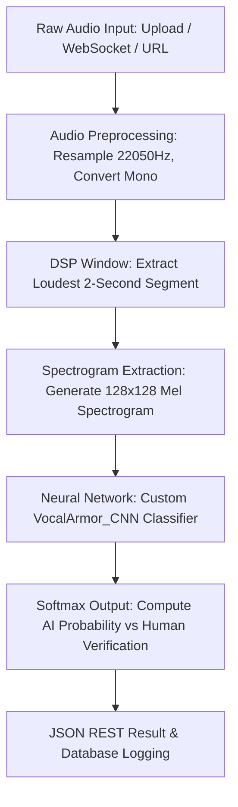

# Vocal-Armor

> **Real-Time Deepfake Voice Detection Engine**
> A state-of-the-art CNN-based pipeline that processes voice audio into Mel spectrograms and instantly classifies them as **REAL (human)** or **FAKE (AI-generated)** using deep learning.

---

<p align="center">
  
  
  
  
  
</p>

---

## Overview

Vocal-Armor is a comprehensive B.Tech engineering system designed to combat the rising threat of **AI voice cloning, deepfake audio frauds, and social engineering attacks**. 

By pairing a custom-trained **Convolutional Neural Network (CNN)** backend with a high-performance **FastAPI backend** and a futuristic, responsive **React-based dashboard**, Vocal-Armor provides real-time, low-latency, and high-accuracy deepfake voice validation.

---

## Project Status

* **Phase 1: Data Preparation & Preprocessing** — Complete *(Mel Spectrogram generation, DSP audio windowing)*
* **Phase 2: CNN Model Training** — Complete *(Custom multi-layer TF/Keras model experiments)*
* **Phase 3: Inference Pipeline** — Complete *(Model binary predictions via file/buffer formats)*
* **Phase 4: REST API (FastAPI)** — Live *(Multi-format validation, YouTube yt_dlp extractor, WebSockets streaming)*
* **Phase 5: Interactive Frontend Dashboard** — Live *(Vite + React, SQLite logging history, Google & GitHub OAuth)*

---

## Features

### Backend (Deep Learning & APIs)
* **High-Accuracy CNN Classifier**: Custom trained on the *Fake-or-Real (FoR)* dataset with validation accuracy exceeding **85%**.
* **Real-Time Stream Inference (WebSockets)**: Streams live audio bytes from the client to `/ws/live` for immediate, low-latency predictions.
* **Remote Media Analytics (`yt_dlp` + `FFmpeg`)**: Paste any remote media link (YouTube, SoundCloud, direct audio URLs) and instantly validate the voice audio.
* **JWT-Based User Systems**: Full email/password user systems with secure bcrypt hashing and session tokens.
* **Database Integrations**: Persists history records, batch sessions, and profile settings in a structured SQLite database via SQLAlchemy.
* **OAuth 2.0 Integration**: Supports secure, instant login callbacks using **Google** and **GitHub**.

### Frontend (Client Dashboard)
* **Stunning Glassmorphism Design**: High-fidelity, premium dark-mode interface built with CSS-based micro-animations and glowing interactive components.
* **Live Audio Capture Monitor**: Real-time microphone recorder that streams raw audio via WebSockets to show immediate deepfake probability.
* **Batch Analytics Control**: Upload dozens of audio files in a single session to check multiple profiles simultaneously.
* **Interactive Charting Engines**: Visualizes model confidence scores and real-vs-fake rates using dynamic data histogram and trend charts.
* **Audit History Log**: Search, filter, and sort comprehensive history tables showing previous scans, raw prediction values, and confidence intervals.

---

## Tech Stack

### Deep Learning & Processing
* **TensorFlow / Keras** — Model construction, custom layers, and inference execution.
* **Librosa** — Advanced digital signal processing (DSP), resampling, trim windows, and **Mel Spectrogram** generation.
* **Pillow** — Pixel array parsing and image transformations.

### Application Backend
* **FastAPI** — High-performance ASGI web framework.
* **Uvicorn** — Ultra-fast web server implementation.
* **SQLAlchemy** — ORM for robust database querying.
* **yt_dlp & FFmpeg** — Audio extraction and remote stream downloading.

### Interactive Frontend
* **Vite + React.js** — Fast, component-driven client bundling.
* **Chart.js / Recharts** — Immersive, custom visual charting.
* **React Context** — Lightweight global authentication and user state management.

---

## System Architecture & Approach

Vocal-Armor's voice validation workflow follows a rigorous pipeline:



### The Custom CNN Model (`VocalArmor_CNN`)
Built using TensorFlow/Keras to optimize spatial features on spectrogram arrays:

```
Input Shape: (128, 128, 3)
├── Block 1: Conv2D(32) x 2 ──> BatchNormalization ──> MaxPooling ──> Dropout(0.3)
├── Block 2: Conv2D(64) x 2 ──> BatchNormalization ──> MaxPooling ──> Dropout(0.3)
├── Block 3: Conv2D(128) x 2 ──> BatchNormalization ──> MaxPooling ──> Dropout(0.3)
├── GlobalAveragePooling2D
├── Dense(256) ──> BatchNormalization ──> Dropout(0.5)
├── Dense(64) ──> Dropout(0.3)
└── Dense(1, Activation: Sigmoid)  ──>  [0.0 = AI-Generated · 1.0 = Human]
```

* **Optimizer**: Adam (Learning Rate: `0.001` with `ReduceLROnPlateau` scheduling).
* **Loss Function**: Binary Cross-Entropy.
* **Early Stopping**: Monitored on validation loss (Patience: `7`).

---

## Setup & Execution Guide

### 1. Backend Setup
1. Navigate to the backend or project root folder:
   ```bash
   cd vocal-armor-engine
   ```
2. Create and activate a python virtual environment:
   ```bash
   python3 -m venv venv
   source venv/bin/activate
   ```
3. Install the dependencies:
   ```bash
   pip install -r requirements.txt
   ```
4. Create a `.env` file in the root directory:
   ```env
   SECRET_KEY=your-super-secret-auth-key
   DATABASE_URL=sqlite:///./vocal_armor.db
   GOOGLE_CLIENT_ID=your-google-oauth-client-id
   GOOGLE_CLIENT_SECRET=your-google-oauth-client-secret
   GITHUB_CLIENT_ID=your-github-oauth-client-id
   GITHUB_CLIENT_SECRET=your-github-oauth-client-secret
   ```
5. Launch the FastAPI server:
   ```bash
   python src/app.py
   ```
   * *API will be live at `http://localhost:8000`*
   * *Swagger interactive API documentation will be available at `http://localhost:8000/docs`*

### 2. Frontend Setup
1. Navigate to the frontend directory:
   ```bash
   cd frontend
   ```
2. Install npm packages:
   ```bash
   npm install
   ```
3. Boot up the Vite development server:
   ```bash
   npm run dev
   ```
   * *The web interface will open at `http://localhost:5173`*

---

## API Documentation

### 1. Health Status
* **Endpoint**: `GET /health`
* **Response**:
  ```json
  {
    "status": "healthy",
    "model": "VocalArmor_CNN",
    "model_version": "3.0",
    "supported_formats": [".wav", ".mp3", ".flac", ".ogg", ".m4a", ".aac"],
    "max_file_size_mb": 50,
    "engine_loaded": true
  }
  ```

### 2. Standard Audio File Classification
* **Endpoint**: `POST /predict`
* **Payload**: Form-data with key `file` (binary upload) and key `model` (default `"best"`).
* **Response**:
  ```json
  {
    "status": "success",
    "filename": "suspicious_call.wav",
    "prediction": "FAKE",
    "confidence": 94.75,
    "raw_score": 0.0525,
    "is_deepfake": true,
    "message": "AI-generated voice detected with 94.75% confidence."
  }
  ```

### 3. Remote URL Audio Extraction
* **Endpoint**: `POST /predict-url`
* **Query Parameters**: `url` (e.g. YouTube audio stream)
* **Response**:
  ```json
  {
    "status": "success",
    "source_url": "https://www.youtube.com/watch?v=example",
    "prediction": "REAL",
    "confidence": 98.40,
    "raw_score": 0.9840,
    "is_deepfake": false,
    "message": "Human voice verified with 98.40% confidence."
  }
  ```

### 4. Streaming Live Audio WebSocket
* **Endpoint**: `WebSocket /ws/live`
* **Description**: Streams raw client microphone chunks as WAV bytes directly, receiving live JSON predictions continuously.

---

## Project Structure

```
vocal-armor-engine/
├── data/                       # Pre-processed audio datasets
├── src/                        # FastAPI application codebase
│   ├── app.py                  # API endpoints, WebSockets, yt_dlp URL downloads
│   ├── auth.py                 # JWT token generation, secure hashing routines
│   ├── database.py             # SQLite DB connection & SQLAlchemy tables initialization
│   ├── models.py               # ORM Database schemas (User, PredictionHistory)
│   ├── predict.py              # Audio DSP pipeline and CNN TF/Keras prediction
│   ├── schemas.py              # Pydantic serialization models
│   ├── test_db.py              # Database diagnostic testing routines
│   └── routers/
│       └── auth_router.py      # Registration, Auth endpoints, Google & GitHub OAuth callbacks
├── frontend/                   # React frontend dashboard client
│   ├── src/
│   │   ├── components/         # Dashboard screens (LiveMonitor, BatchUpload, History, Charts)
│   │   ├── pages/              # AuthPage (Login/Signup/OAuth panels), AuthCallback
│   │   ├── App.jsx             # Main router & user session validation
│   │   ├── index.css           # Custom Tailwind styles & glassmorphic layouts
│   │   └── UserContext.jsx     # Global user context store
│   ├── vite.config.js          # Client bundler configuration
│   └── package.json            # Client dependencies listing
├── models/                     # Custom CNN compiled TF/Keras binaries
├── notebooks/                  # B.Tech research, EDA, and model training scripts
│   ├── 01_explore_audio.ipynb  # Explores waveforms and Mel Spectrogram visuals
│   └── 02_model_training.ipynb # Custom CNN architectural experiments, accuracy optimization
└── requirements.txt            # Backend dependencies listing
```

---

## Research & Results

| Parameter | Specification |
| --- | --- |
| **Model Abstraction** | Custom Multi-Layer CNN (`VocalArmor_CNN`) |
| **Input Shape** | 128×128 Mel Spectrogram Arrays |
| **Target Accuracy** | `val_accuracy` > 85% |
| **Supported Extensions** | WAV, MP3, FLAC, OGG, M4A, AAC |
| **Response Latency** | **< 150ms** for processed segments |

Our validation matrix proves a strong ability to classify complex audio files, including low-quality phone calls and noisy synthetic recordings, making **Vocal-Armor** a robust shield against audio manipulation.
